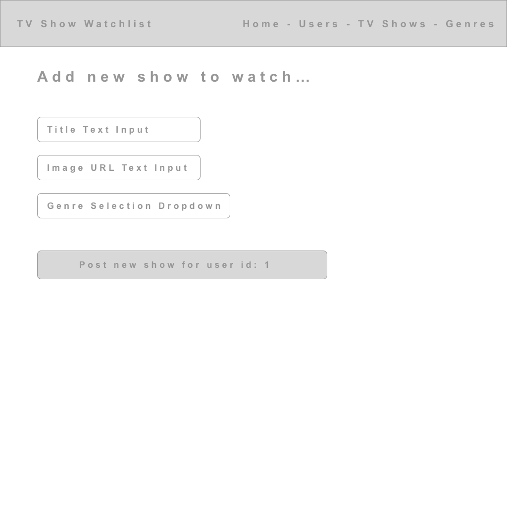

# Comprehensive Technical Assessment - Practical

## Opening Remarks

This exam, like many exams before it, will be an **open-book, project-driven exam**.

- You are permitted the use of online resources, including your notes. 
- You are not permitted to discuss the exam with your peers or to share code. If you have questions, or would like to discuss details of the exam, please talk to an instructor or TA.
- You are welcome (encouraged, required) to utilize GitHub and Git for this exam. Until the conclusion of the exam period, please **make your repositories private** and invite the 5.2 staff as collaborators to your repo. 
  - mmosayed
  - mottaquikarim
  - Ceejaymar
  - Dinnall
  - susanahan
- As you continue to work through this project make regular commits because we will be monitoring your commit history for code consistency and educational integrity.

## TV Show Watchlist App

TV Show Watchlist will be a full-stack application where users can post, comment on, and favorite TV shows that they are binging on.

* The app does **not** need user authentication, and does not need passwords - only usernames. You can assume from the front end that your logged in user is whichever user ID from the database.
* Users should be able to **post shows** that they watch. These shows are shared on their profile pages.
* Users can view the profile pages of other users.
* Users should be able to **comment** on other users' shows. Comments should include the comment's text as well as the username of the user who posted the comment.

### Database Structure

The following tables and columns will be necessary:

- **Users**
  - id
  - username - *Unique*
- **Genres**
  - id
  - genre_name - *Unique*
- **Shows**
  - id
  - title
  - img_url
  - user_id - *References Users*
  - genre_id - *References Genres*
- **Comments**
  - id
  - comment_body
  - user_id - *References Users*
  - song_id - *References Songs*

### API Endpoints

Your API Endpoints should include at least:

- **Users**
  - GET all users
  - GET single user
  - POST new user
- **Genres**
  - GET all genres
- **Shows**
  - GET all shows
  - GET all shows for specific genre_id
  - GET all shows for specific user_id
  - GET one show
  - POST new show
- **Comments**
  - GET all comments for specific show_id
  - POST new comment

### Frontend

Your frontend must include the following routes/pages:

| Mockup | Feature |
| ---    | ---     |
|  | **`/` :** Home route. Should just welcome the user to the applciation. Must include Navbar, links, display message.
|  | **`/users` :** Shows master list of all users. Shows the "logged in" user. Should be able to click on each username linking to the user page.
|  |  **`/user/:id` :** Shows all the shows the user is watching. Must show the image, title, genre. Should be able to click on the show and take you to the show page.
|  | **`/user/post` :** Shows a form where the logged in user can add a new show. Should be able to submit to the DB
|  |  **`/show/:id` :** The user's shows profile page. Shows the title, image, genre, number of comments and list of comments. Allows you to add new comments.
|  |  **`/shows` :** Masterlist of all the shows. Don't repeat the same show twice. For each show list all the users who are watching. Clicking on the name of the user takes you to the users show profile page. 

